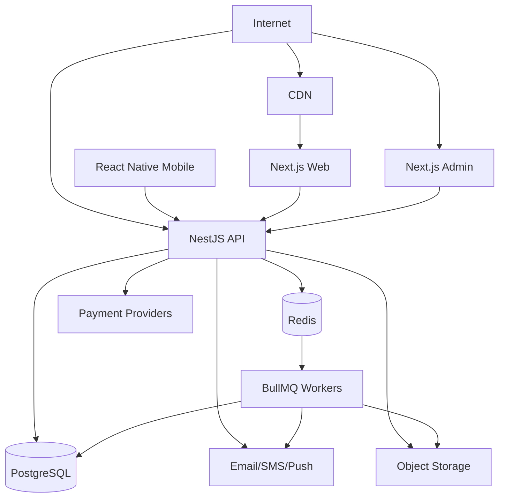

# Deployment Diagram

```mermaid
flowchart TB
    INTERNET[Internet] --> CDN[CDN]
    CDN --> WEB[Next.js Web]
    INTERNET --> ADMIN[Next.js Admin]
    INTERNET --> API[NestJS API]

    MOBILE[React Native Mobile] --> API
    WEB --> API
    ADMIN --> API

    API --> PG[(PostgreSQL)]
    API --> REDIS[(Redis)]
    API --> STORAGE[Object Storage]
    API --> PAY[Payment Providers]
    API --> EMAIL[Email/SMS/Push]
    REDIS --> WORKER[BullMQ Workers]
    WORKER --> PG
    WORKER --> EMAIL
    WORKER --> STORAGE
```

Recommendation: put a reverse proxy/WAF in front of production public endpoints and keep database/Redis private.
