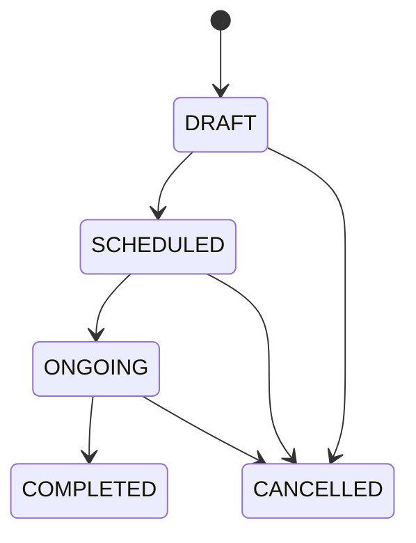

# Event Lifecycle

```mermaid
stateDiagram-v2
    [*] --> DRAFT
    DRAFT --> SCHEDULED
    SCHEDULED --> ONGOING
    ONGOING --> COMPLETED
    DRAFT --> CANCELLED
    SCHEDULED --> CANCELLED
    ONGOING --> CANCELLED
```

Publication is orthogonal:
`published=false` for private/draft states; publication is controlled independently from lifecycle status.
