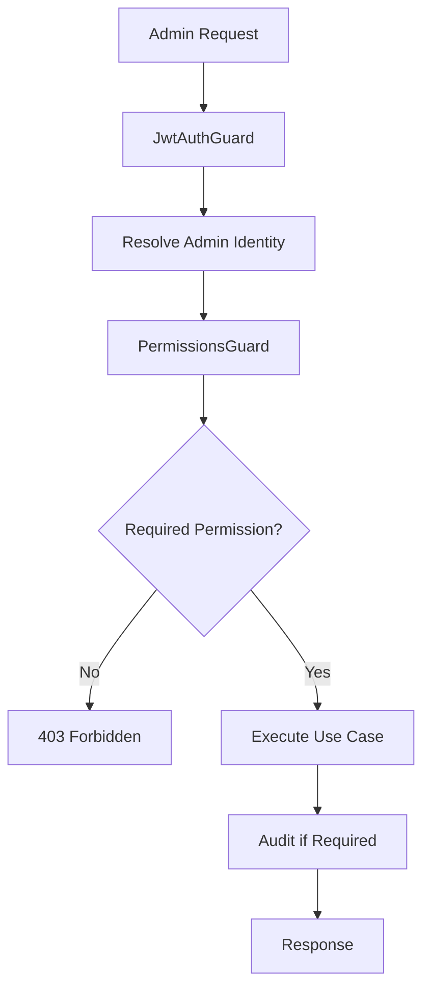

# Admin RBAC Flow

```mermaid
flowchart TD
    A[Admin Request] --> J[JwtAuthGuard]
    J --> R[Resolve Admin Identity]
    R --> P[PermissionsGuard]
    P --> C{Required Permission?}
    C -->|No| D[403 Forbidden]
    C -->|Yes| S[Execute Use Case]
    S --> L[Audit if Required]
    L --> OK[Response]
```
