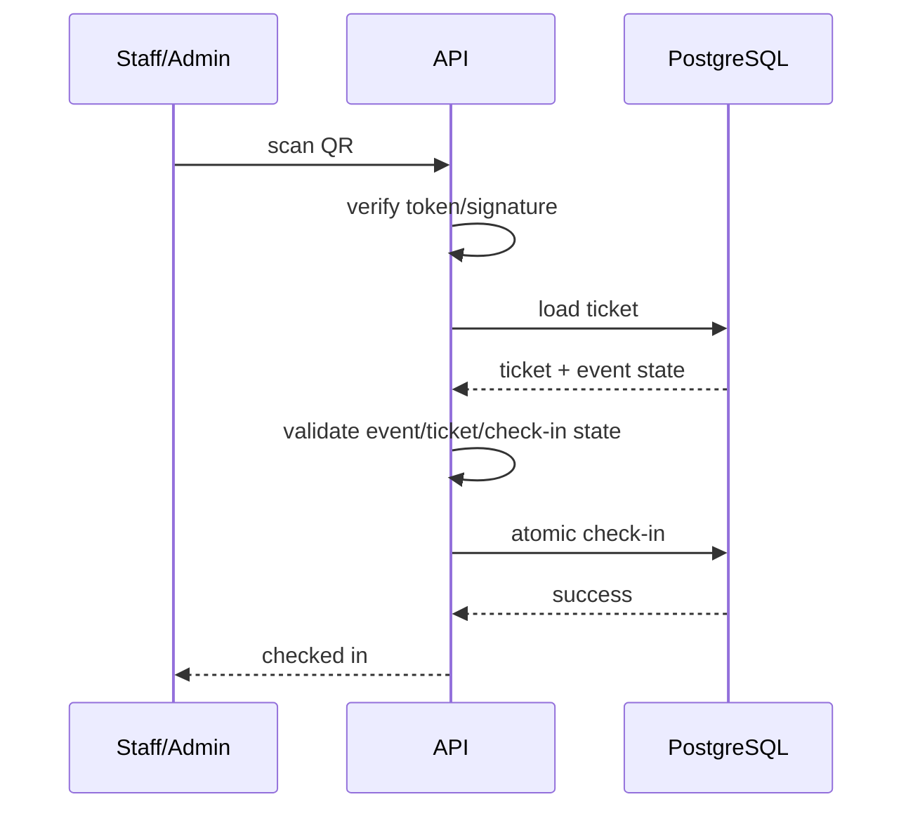

# Ticket Check-in Sequence

```mermaid
sequenceDiagram
    participant S as Staff/Admin
    participant API as API
    participant DB as PostgreSQL

    S->>API: scan QR
    API->>API: verify token/signature
    API->>DB: load ticket
    DB-->>API: ticket + event state
    API->>API: validate event/ticket/check-in state
    API->>DB: atomic check-in
    DB-->>API: success
    API-->>S: checked in
```
